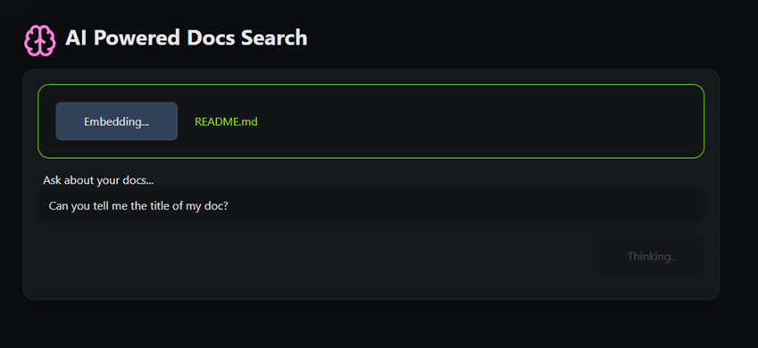

# AI Powered Documents Search (RAG)



<br />

# Features:

- Upload a PDF/Markdown knowledge base
- Search using natural language queries
- AI answers with citations from your data

# Information
- Retrieval-Augmented Generation (RAG) is an AI framework that uses external data sources to enhance a large language model's (LLM) responses.
- LangChain is a framework for developing applications powered by large language models (LLMs)
- Supabase is an open-source backend-as-a-service (BaaS) platform that offers a suite of tools, including a fully managed PostgreSQL database.
- AI Vectors in Supabase are enabled via pgvector, a Postgres extension for storing and querying vectors in Postgres. It can be used to store embeddings.

# Install and usage

### Backend/SQL:

- This starter ingests PDFs/MD/TXT, embeds chunks into Supabase (pgvector), and answers questions with RAG.
1) Create `.env.local` based on `.env.example`.
2) Create a Supabase project and enable `vector` extension.
3) Run the SQL in `supabase_match_fn.sql` to create the `match_documents` RPC and create the `docs` table (see section 5. below)

4) Set `SUPABASE_URL`, `SUPABASE_SERVICE_ROLE`, and `SUPABASE_ANON_KEY` in `.env.local`.

5. SQL you need to run once in Supabase (SQL editor):
```bash
create extension if not exists vector;
create table if not exists docs (
  id uuid primary key default gen_random_uuid(),
  source text,
  page int,
  chunk text,
  embedding vector(1536)
);
create index on docs using ivfflat (embedding vector_cosine_ops) with (lists = 100);
```
### Frontend:
```bash
clone git repository

npm i
npm run dev
```

# Technologies
- Next.js
- LangChain.js
- vector DB (Supabase)
